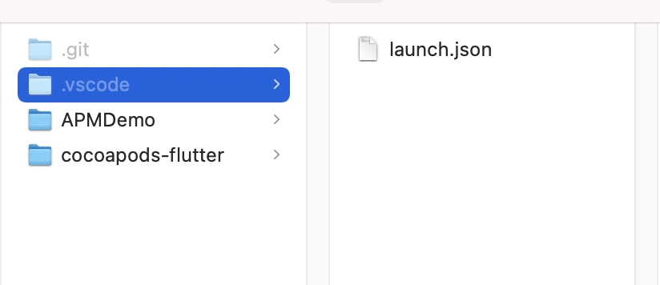

# Cocoapods插件工程配置
## 创建cocoapods插件
1. 创建插件：``pod plugins create cocoapods-xxx``
2. 将创建好的插件和一个iOS工程放到同一个目录。
3. 在该目录下创建launch.json文件。
4. 
5. 配置工程
*  在iOS工程下，进入Podfile文件，写下``plugin 'cocoapods-xxx'``
*  检查Gemfile文件，如果没有`ruby-debug-ide`和`debase`需要加入这两个gem，``gem 'ruby-debug-ide'``，``gem 'debase'``
编写cocoapods_plugin.rb文件：
```
module Pod
  module CocoapodsHook
    @hooks_manager = Pod::HooksManager
    @hooks_manager.register('cocoapods-flutter', :pre_install) do |_, _options|
      puts "pre_install"
    end
    @hooks_manager.register('cocoapods-flutter', :source_provider) do |_context, _options|
      puts "source_provider"
    end
    @hooks_manager.register('cocoapods-flutter', :post_install) do |_context, _options|
      puts "post_install"
    end
  end
end
```
编写.launch.json文件

