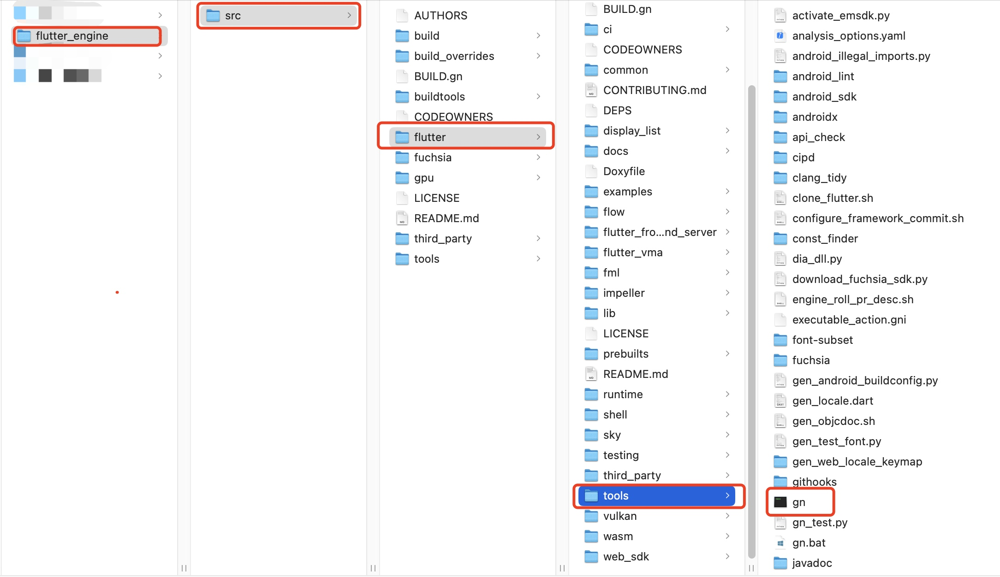

# Flutter引擎下载与编译
## 辅助工具准备
* 安装[Chromium](https://wiki.archlinuxcn.org/zh-sg/Chromium)提供的部署工具[depot_tools](http://commondatastorage.googleapis.com/chrome-infra-docs/flat/depot_tools/docs/html/depot_tools_tutorial.html#_setting_up)
```
git clone https://chromium.googlesource.com/chromium/tools/depot_tools.git
```
* 配置环境变量
```
# 自定义命令行工具目录
export WF_BIN=$HOME/.wf/bin
# depot tools 命令工具
export PATH=$WF_BIN/depot_tools:$PATH
```
* github配置SSH
> 自行google
* 安装ant工具(Java开发构建工具)
```
brew install ant
```
## 下载引擎
* 可以fork[flutter engine](https://github.com/flutter/engine)到自己的git账户下，切记不要直接本地clone它，下载引擎的操作要交个`gclient`工具来完成。
* 新建引擎目录flutter_engine（注意：路径不能有中文）
```
cd path/
mkdir flutter_engine
```
* 创建gclient文件(通过gclient下载源码)
```
touch .gclient
```
* 编辑gclient文件
```
solutions = [
{
   "managed": False,
   "name": "src/flutter",
   "url": "git@github.com:flutter/engine.git@d44b5a94c976fbb65815374f61ab5392a220b084",
    "custom_deps": {},
    "deps_file": "DEPS",
    "safesync_url": "",
}, 
]
```
**注意：**@后表示下载哪个commitId节点的引擎
* 获取引擎commitId
```
cat flutter_sdk(flutterSDK目录)/bin/internal/engine.version

d44b5a94c976fbb65815374f61ab5392a220b084
```
* 开始安装
```
gclient sync
```

**注意：** 此过程需要科学上网，下载过程较慢，文件大小接近20个G，如果中途因为网络原因下载终止，可继续执行此命令`gclient sync`，该命令会继续下载，不会重头开始。
## 引擎升级
如果想更新引擎源码，可以执行如下操作。
* 获取要更新到的引擎commitId，替换.gclient文件中@后边的部分
* 进入到flutter_engin/src/flutter目录。
```
# 先执行一次
git pull
# 然后
git reset --hard `commitId`
```
**注意：**`git reset --hard commitId`命令是告诉git下次下载就下载这个commitId对应的代码。
* 回到flutter_engine目录（.gclient文件所在的目录）执行：
```
gclient sync --with_branch_heads --with_tags --verbose
```
## 引擎编译
### 构建引擎
* 使用`gn`这个命令行工具构建引擎工程使他成为一个xcode工程，这是一个使用ninja构建文件的元构建系统，最后还是使用ninja编译。`gn`命令所在目录：


进入到该目录：
```
cd flutter_engine/src/flutter/tools
```
* 开始构建
执行如下命令：
```
# 构建iOS真机使用的引擎
# 构建支持真机支持的debug引擎
./gn --ios --unoptimized --no-goma
# 构建真机支持的release引擎
./gn --ios --unoptimized --runtime-mode=release --no-goma
# 构建模拟器支持的引擎
./gn --ios --simulator --unoptimized --no-goma
# 构建支持mac(主机端)的引擎，热重载
./gn --unoptimized --no-goma
```
* 参数介绍
*     1、`--ios`：构建支持iOS系统的引擎，默认是调试（debug）构建
*     2、`--runtime-mode`：可以指定构建支持`debug`、`profile`、`release`
*     3、`--simulator`：构建支持iOS模拟器的引擎
*     4、`--unoptimized`：禁用C++编译器优化
*     5、`--no-goma`：googler使用goma可以加快构建
执行该命令会在src目录下创建一个out目录，构建的产物（xcode工程）会被放到该目录。
### 设置goma（戈马）
对于 Google 员工来说，Goma (go/ma) 是一种分布式编译器服务，可以大大加快构建时间。有两种方法可以获取 Goma 并在引擎构建中使用它：
1. 直接从CIPD下载英手动安装。
2. 在`.gclient`文件中设置附加变量
#### 手动安装
创建一个shell脚本文件，复制如下代码：
```
#!/bin/bash

    # Customize this to where you would like Goma to be installed.
    export GOMA_DIR="$HOME/.wf/bin/flutter_goma"

    # Download client. Assumes cipd from depot_tools is on path.
    # NOTE: There is no arm64 Mac distribution of Goma, so you'll need to replace
    #       `${platform}` with `mac-amd64` below if running an Apple Silicon Mac.
    echo 'fuchsia/third_party/goma/client/${platform}  integration' | cipd ensure -ensure-file - -root "$GOMA_DIR"

    # Authenticate
    "$GOMA_DIR/goma_auth.py" login --browser

    # Start Goma
    "$GOMA_DIR/goma_ctl.py" ensure_start
```
执行该脚本，获取并运行goma客户端。
#### 设置`.gclient`文件
将以下内容添加到`.gclient`文件中，`gclient sync`将下载正确的版本并确保goma在构建时已启动
```
solutions = [
  {
    # Same as above...
    "custom_vars": {
      "use_cipd_goma": True,
    },
  },
]
```
**注意：**由于我们是非googler使用的是自己的账号，在调用`gclient_auth.py`脚本进行身份校验时，验证不通过，所有并不能使用`goma`工具，在构建时要加上`---nogoma`参数。
### 编译引擎
使用`ninja`命令进行编译，进入到flutter_engine/src/out目录，执行如下命令开始编译。
```
ninja -C host_debug_unopt 
ninja -C ios_debug_sim_unopt
ninja -C ios_debug_unopt
ninja -C ios_release_unopt
```
这可以编译出支持不同模式下的引擎源码工程。       
**注意：**此过程较为耗时，编译完成后，生成的文件也比较大。
## 引擎调试
### 使用本地引擎运行flutter应用
首先，确保已构建了适当版本的引擎。
* 创建flutter应用
```
flutter create xxx
```
* 使用以下命令运行flutter应用
```
flutter run --local-engine=xxx --local-engine-src-path=yyy --local-engine-host=zzz
```
使用本地引擎运行应用程序，`xxx`是你希望使用的引擎类型，例如，你如果以debug模式运行在真机上，就使用`--local-engine=ios_debug_unopt`，如果运行在模拟器就使用`--local-engine=ios_debug_sim_unopt`，如果调试Android引擎就使用`--local-engine=android_debug_unopt`。`--local-engine-src-path`指向`src`文件所属的路径。
> **注意：** `--locala-engine-host`，从[#132245](https://github.com/flutter/flutter/issues/132245)，将强制要求。
> 如果当前是隐式的依赖主机引擎，则需要改为显式依赖引擎，例如，如果当前运行`flutter run --local-engine=ios_debug_unopt`，需要改为`flutter run --local-engine=ios_debug_unopt --local-engine-host=host_debug_unopt`。
* 使用vscode调试
你需要在启动文件中添加新的配置`launch.json`：
```
{
  "version": "0.2.0",
  "configurations": [
    {
      "name": "Launch (local engine)",
      "request": "launch",
      "type": "dart",
      "args": ["--local-engine", "xxx", "--local-engine-src-path", "yyy", "--local-engine-host", "zzz"]
    }

    // Other profiles below..
  ]
}
```
确保vscode已经链接上一台设备，点击`F5`开始调试。

* 使用Xcode调试
使用Xcode调试本地引擎还有一大有点是可以下断点。
要使用Xcode调试，需要配置两个flutter参数，`FLUTTER_ENGINE`和`LOCAL_ENGINE`，其中`FLUTTER_ENGINE`对应的就是`--local-engine-src-path`，`LOCAL_ENGINE`对应的就是`--local-engine`。

1. 直接编辑**Generated.xcconfig**

使用Xcode打开**Runner.xcworkspace**，编辑**Generated.xcconfig**文件，添加`FLUTTER_ENGINE`和`LOCAL_ENGINE`参数。如下所示：


2. 配置脚本
点击**Runner -> Build Phases -> Run Script**，添加如下命令：
```
echo "FLUTTER_ENGINE=/Users/wf/sohu/vendorCode/flutter_engine/src" >> ${SRCROOT}/Flutter/Generated.xcconfig
echo "LOCAL_ENGINE=ios_debug_unopt" >> ${SRCROOT}/Flutter/Generated.xcconfig
```


* 断点调试

在Xcode中下一个断点来验证一下，以上的配置是否正确，断点是否能被下到我们的本地引擎中。
点击**Debug -> Breakpoints -> Create Symbolic -> Breakpoint**，输入符号`FLTDefaultSettingsForBundle`，这个符号是flutter引擎源码中的一个C函数，开始运行**CMD+R**，得到如下结果：

可以看到，断点已经生效，程序停在了`FlutterDartProject.mm`文件中的`FLTDefaultSettingsForBundle`这个函数中，我们可以看下`FlutterDartProject.mm`这个文件的完整目录：


* 修改源码
当我们修改了源码，比如加了一句`NSLog(@"hello world!!!");`，重新运行程序，发现并没有输出，是源码不能修改吗？？？
我们来分析一下程序编译后的产物，**Product -> Show Build Folder in Finder -> Products -> Debug-iphoneos -> Runner -> 右键显示包内容 -> Frameworks -> Flutter.framework -> FLutter**，程序直接链接的是一个flutter.framework，这是一个flutter引擎被编译后的一个动态库，我们在每次运行程序，不会立刻将引擎源码编译成动态库。所以想要修改源码并且生效，我们需要单独编译引擎，使用`ninja`这个命令。
`cd`到`out`这个目录，执行如下命令重新编译：

    ```
    ninja -C ios_debug_unopt
    ```
这个命令会重新生成`Flutter.framework`，这个`Flutter.framework`会被应用程序重新链接。

重新运行程序，检查刚才的修改是否生效！！！Perfect！！！