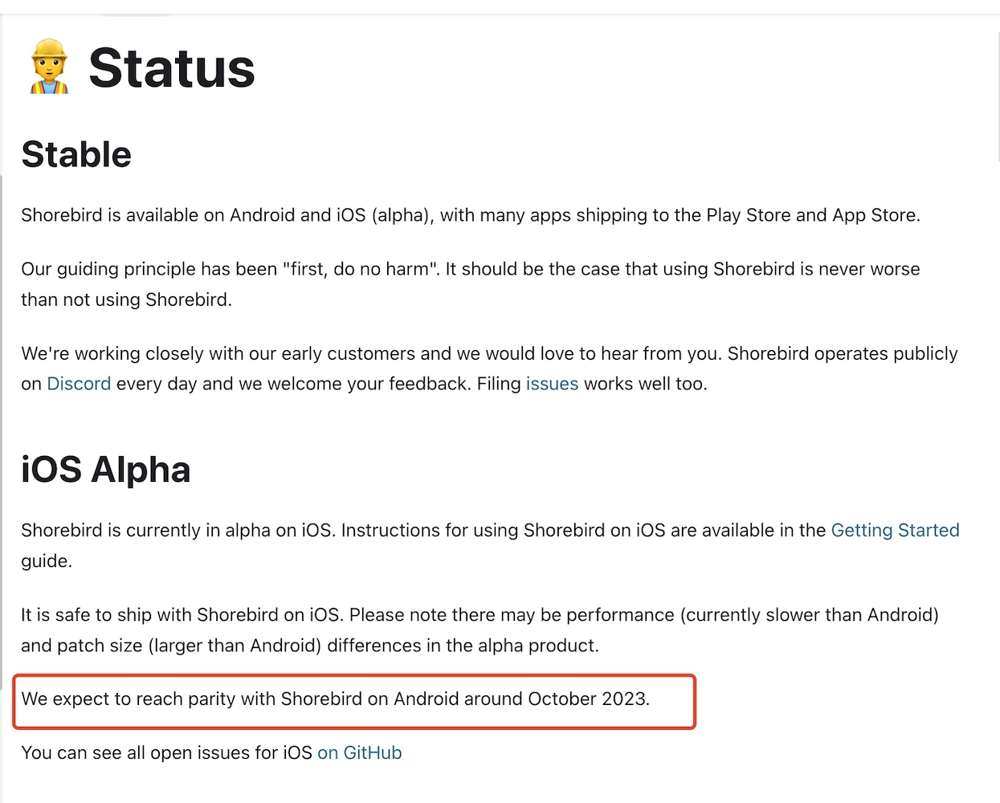

# Shorebird方案iOS调研

## 好消息
shorebird官网给出的消息是将在2023年10月份左右达到android同样的水平。


## 已知问题
### 滑动卡顿掉帧
`shorebird`在issue中给出的解释是总体应用程序慢2-10倍，其原因是iOS执行可执行文件的流程是通过dyld链接器将可执行文件`Mach-o`加载到内存运行。而`shorebird`在iOS上运行dart代码，是基于`dart vm`的`elf`文件解释器执行一个dart文件，而这个dart文件就是一个elf格式的二进制文件。`shorebird`构建的`iOS patch`包就是一个elf文件，名为`out.aot`，dart虚拟机在iOS设备上执行elf格式文件效率不如执行`Mach-o`文件。

```
>>> file out.aot
>>> out.aot: ELF 64-bit LSB shared object, ARM aarch64, version 1 (SYSV), 
    dynamically linked, BuildID[md5/uuid]=c81d76e16a17548505892ebc808e7eef, 
    with debug_info, not stripped
```
#### shorebird的解决方案
* 编写一个Mach-o解释器（符合Appstore规范的解释器）
> 使用与加载Mach-o同样的方式加载dart patch包，这个`Mach-o`解释器就是用来执行dart编译好的二进制。
  原始文件和更改后的文件（patch包）分开执行。原始dart代码执行在真实的CPU上，更改后的dart代码执行在解释器上。
* 链接器
> 让新的编译后的Dart代码与现有的、已签名的Dart代码(包含在ipa/apk中)进行拼接。链接器的工作将混合模式运行时连接到已有Dart代码。

### iOS patch包比Android的要大
在执行patch指令打iOS包的时候，是把dart的所有代码打成`out.aot`文件，push到端上替换执行。Android会进行diff比较，把改动的代码push到端上执行。解决方案：就是上边提到的构建一个Mach-o解释器，来执行修改后的dart代码。

## 引擎的改动
shorebird团队目前已经有90多次新的提交，并且落后了flutter官方2000多次commit。通过查看文件的变动，我们发现，shorebird团队在开源出来的引擎代码改动基本是文件配置、impeller目录下、shell目录下等。

### shell目录包含哪些功能：
1. 平台适配层：flutter与不同平台的通信部分，与操作系统硬件交互的代码。
2. 输入处理：包括键盘处理、触摸、鼠标等。
3. 渲染相关：
4. 插件支持：
5. 命令相关的配置文件：
6. ......

### impeller:
1. 渲染相关的功能，包括backends（图形后端实现）、图片处理、文本排版等等。

### 其他文件的修改
`DEPS`文件的改动值得注意一下，
1. 新增了'dart_sdk_git' => 'git@github.com:shorebirdtech/dart-sdk.git'
2. 新增了'updater_git' => 'https://github.com/shorebirdtech/updater.git'
3. 修改了'buildroot', => 'https://github.com/shorebirdtech/buildroot.git'
4. ......

## 怎么做？
flutter引擎是一个很复杂庞大的项目，其构建过程也繁琐，它不仅仅是从git仓库克隆下来就能阅读源码或者运行调试，它整个下载、构建、编译是依赖于Google的一个`ninja`项目的`gn`命令。它的整个构建是需要在一个有网络的环境，将配置文件中依赖的项目，更新到本地，再构建成完整的引擎项目。所以可能需要研究多个项目：
1. dart虚拟机。这个项目是开源的，[dart_lang](https://github.com/dart-lang/sdk)。
2. shorebird的[updater](https://github.com/shorebirdtech/updater)项目。这是一个rust项目，code push系统。
3. [buildroot](https://github.com/shorebirdtech/buildroot)。构建引擎依赖的项目，这也是shorebird团队fork了flutter官方后进行了定制。
4. 引擎的构建过程。
5. 上边提到的Mach-o解释器，链接器。

# 参考
* [shorebird官网](https://docs.shorebird.dev/status)。
* [shorebird patch ios builds run about 100x slower than necessary](https://github.com/shorebirdtech/shorebird/issues/674)
* [support differential patches on iOS](https://github.com/shorebirdtech/shorebird/issues/675)
* [use mach-o for bundling rather than elf on iOS](https://github.com/shorebirdtech/shorebird/issues/637)
* [shorebird flutter engine](https://github.com/shorebirdtech/engine)