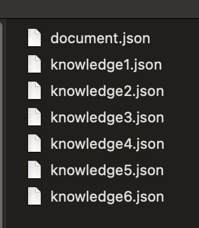

# python环境准备
1. 安装`pyenv`管理多个版本的python
```
brew install pyenv
```
2. 配置shell：

 在你的shell配置文件（如 .bashrc, .zshrc, .bash_profile，或 .profile）中添加以下容：
```
export PATH="$HOME/.pyenv/bin:$PATH"
eval "$(pyenv init --path)"
eval "$(pyenv init -)"
```

3. 使shell环境变量生效
```
source ~/.zshrc
```
4. 使用`pyenv`

使用如下命令查看可以安装的python版本：
```
pyenv install --list
```

安装指定版本的python：
```
pyenv install 3.12.3
```

设置全局的python版本：
```
pyenv global 3.12.3
```

# 安装依赖
```
pip install -U cos-python-sdk-v5
```

# 脚本使用方法

python环境配置完成后并且安装好python依赖后，即可使用文档上传脚本，使用方法如下：

1. 编写配置文件`document.json`
```
[
	{
		"author": "11",
		"fileName": "knowledge1.txt",
		"name": "文档名字",
		"tags": [
			"新闻",
			"体育"
		]
	},
	{
		"author": "22",
		"fileName": "knowledge2.txt",
		"name": "文档名字2"
		"tags": [
			"新闻1",
			"体育1"
		]
	},
	......
]
```
***参数说明***
* `author`：文档作者
* `name`：文档名称
* `tags`：文档的标签列表
* `fileName`：文档的文件名

2. 文档收集

新建一个文件夹（任意目录即可），把要上传的文档全部放到该目录下，`document.json`可以一并放到该目录下也可以不放到该文件夹。



3. 执行脚本

把脚本文件`k_upload.py`复制到文档所在目录，切换到该目录，开始上传。
```
cd 文档所在目录
python k_upload.py --file=/xxx.document.json
```
**参数说明**

 --file：配置文件的路径
 
**说明**

 文档必须在同一目录中，不支持子目录上传，上传文档前必须严格按照`document.json`格式编辑。