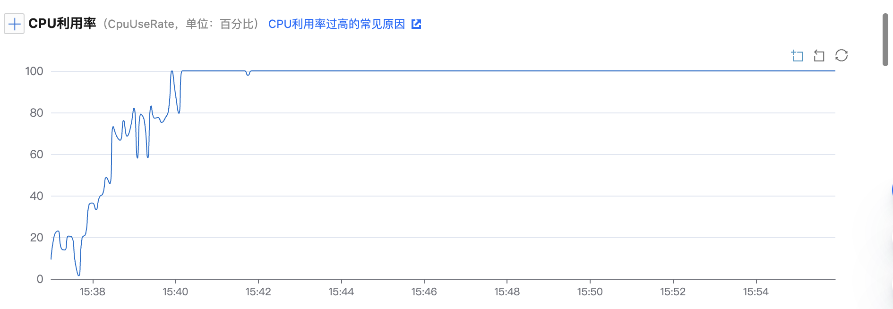
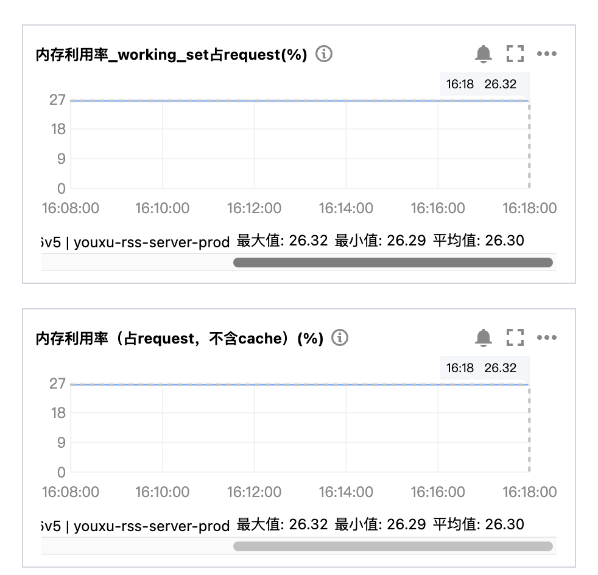

# API接口优化方案

## 压测数据
此次压测针对访问频次最高的`事件查询接口(/fetch/events)`和`文章查询接口(/fetch/articles3)`。
### 硬件准备
* 服务器实例
    * 核数：1cpu
    * 内存：2g
    * 实例总数： 2
* 数据库
    * 核数：1cpu
    * 内存：1g

## [/fetch/events 接口压测结果](file:///Users/wf/Downloads/event_query.html)

当users增加到50时，此时的压测结果是：
QPS：300上下
平均耗时：152ms
50分位耗时：120ms

### 服务器的消耗：

### 数据库的消耗

服务器消耗情况，cpu占用率在50%左右，内存使用率26%。而此时的数据库服务cpu已经长期占满。

查询事件接口目前查询逻辑是按照一定条件分页从数据库中查，使用效率较高的覆盖索引+子查询的方式实现分页查询。但是存在以下不合理地方：
1. 但是分页使用子查询时，使用到了`select *`查询了全量数据，浪费了资源，改为只获取子查询需要的字段，降低数据库服务的消耗。
2. 目前`rss_event`表中已经有接近40个字段，而返回给客户端的字段只需20个，可以只查需要的字段。
3. 对于首屏或者前几屏访问较高的可以采用redis缓存，缓存读完再从数据库中查询。

#### 实现方案
使用`redis`缓存两部分内容：
1. `sorted set`有序集合缓存事件`Id`，`update_at`作为分数；
2. 事件Id作为key，value为表中的这一行记录。
使用redis双重缓存，这样就可以保证接口在查询时的顺序。
如何redis更新？
redis需要更新两部分内容，一个是`sorted set`集合，另外一个是以事件Id作为key，value部分的更新，因为`sorted set`集合只存事件Id，需要在事件归纳完成后生成新的事件，在事件完成写入数据库后，将事件写入`sorted set`集合中。第二个要更新的是事件Id作为key对应的value，这一部分需要在文章合并到事件之后，表明事件更新了，要把事件Id对应的value给更新了。
具体实现方案： 
    * 在事件合并和事件归纳完成后，直接调用redis相关方法同步完成更新。
    * 接口提供服务，在事件合并和归纳完成后调用接口，在服务端完成redis的更新。
    * 使用异步消息队列（MQ）在事件合并和归纳完成后，向MQ发送消息，服务端作为消费者，收到消息后完成redis的更新操作。

* 需要再事件归纳/分组完成后，同步更新`redis`。
* 接口服务先从`redis`取事件Id，再以事件Id作为key获取事件，返回给客户端。

## [/fetch/article3 压测结果](file:///Users/wf/Downloads/article_list.html)

### 服务器的消耗：

### 数据库的消耗

查询文章接口压测结果，效率较高，可以达到500qps，对服务器的压力构不成影响，如果单是这个接口，忽略离线函数的影响，数据库的压力也较为平稳。梳理查询流程仍然有一些优化的空间。        
查询事件下的文章接口，根据客户端要求，需要的字段分布在不同的表中，目前的查询逻辑是根据要求顺序的逐表查询，把查询的结果聚合返回给客户端。执行流程如下：

在原有的查询流程中，查询文章所属的事件id列表和查询文章所属源是两个互相独立不依赖的过程，可以把这个串行的流程改成并行的去做，等所有结果返回再聚合到文章中返回给客户端，这样可以整体减少查询的时间。源内容更新不是很频繁，可以使用redis缓存。
修改后的流程如下：

查询文章接口通过并行+缓存的方式提高了处理的速度同时也能一定程度减少数据库的访问。

## 优化总结
### 业务层优化
* 数据库+redis缓存的方式可以减少数据库的访问。
* 对于首页查询事件接口，梳理返回客户端字段，不使用`select *`操作，减少数据库操作大量的数据。
* 优化索引，通过`explain`查看sql的执行计划，使用高效的索引。
* 互相不依赖的查询，可以并行的去查，提高响应速度。

### 硬件提升
目前数据库的配置为1cpu，1g内存，离线函数对数据库的压力要远远大于接口服务，在没有接口请求的情况下，数据库cpu经常拉满。在线上环境，数据库配置较低的话会引来较大的风险，可以把数据库配置提高以应付更大的请求。

